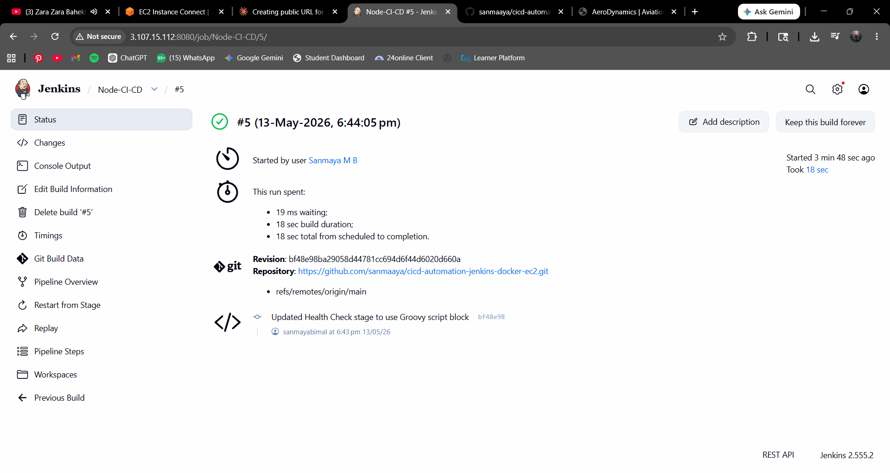
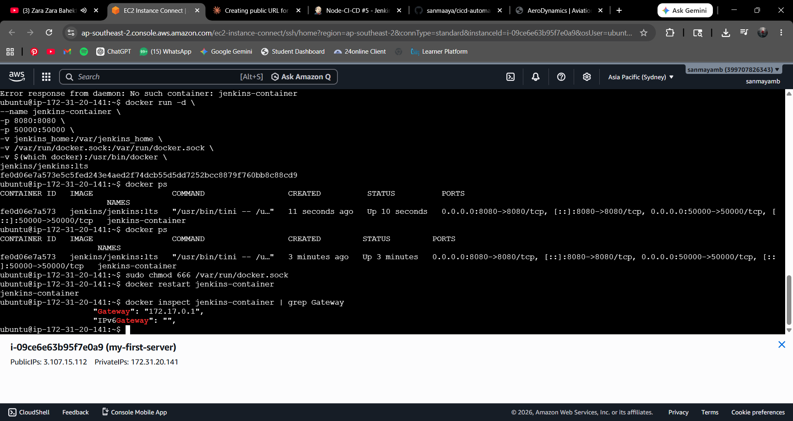
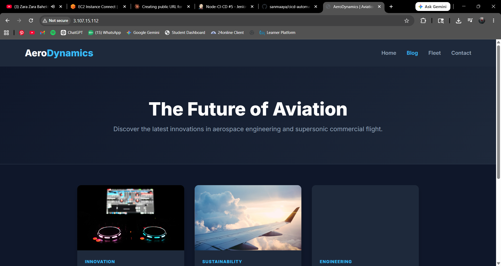

# CI/CD Pipeline for Aviation Blog App

This project demonstrates a complete CI/CD automation pipeline deploying a static HTML/CSS/JS Blog Application using Jenkins, Docker, and AWS EC2.

## Project Structure
- `index.html` - The main blog layout and structure.
- `style.css` - Responsive styling and UI design.
- `script.js` - JavaScript for dynamic blog card rendering.
- `Dockerfile` - Uses `nginx:alpine` to containerize the frontend.
- `Jenkinsfile` - The CI/CD pipeline automation script.

## AWS EC2 Setup Instructions
1. Launch an **Ubuntu EC2 instance**.
2. Configure **Security Groups** to allow inbound traffic on:
   - Port `22` (SSH for terminal access)
   - Port `80` (HTTP for the Nginx Blog App)
   - Port `8080` (Custom TCP for the Jenkins Dashboard)
3. SSH into your instance and install Docker:
   ```bash
   sudo apt update
   sudo apt install -y docker.io
   sudo systemctl enable --now docker
   ```

## Jenkins Setup Instructions
1. Install Jenkins on your EC2 instance (requires Java).
2. Give Jenkins permission to run Docker commands:
   ```bash
   sudo usermod -aG docker jenkins
   sudo systemctl restart jenkins
   ```
3. Open `http://<EC2-PUBLIC-IP>:8080`, retrieve your admin password, and complete the setup wizard.

## GitHub Setup Instructions
1. Push this code to a public or private GitHub repository.
2. In Jenkins, create a new **Pipeline** job.
3. Select "Pipeline script from SCM", choose "Git", and paste your repository URL.
4. Save and click **Build Now**.

## Deployment Steps
The Jenkins pipeline automatically handles deployment by running through these stages:
1. **Checkout**: Pulls code from GitHub.
2. **Build Docker Image**: Runs `docker build`.
3. **Run Container**: Runs `docker stop` and `docker rm` to remove old versions, then `docker run` to deploy the new Nginx container on port 80.
4. **Health Check**: Uses `curl` to validate that the container is responding with HTTP 200.
5. **Deploy**: Confirms successful deployment.
6. **Cleanup**: Removes dangling images to save disk space.

## Execution Screenshots

Below are the screenshots captured during the execution and deployment of this CI/CD pipeline.

<p align="center">
  <br>
  <em>Screenshot 1</em>
</p>

<p align="center">
  <br>
  <em>Screenshot 2</em>
</p>

<p align="center">
  <br>
  <em>Screenshot 3</em>
</p>
